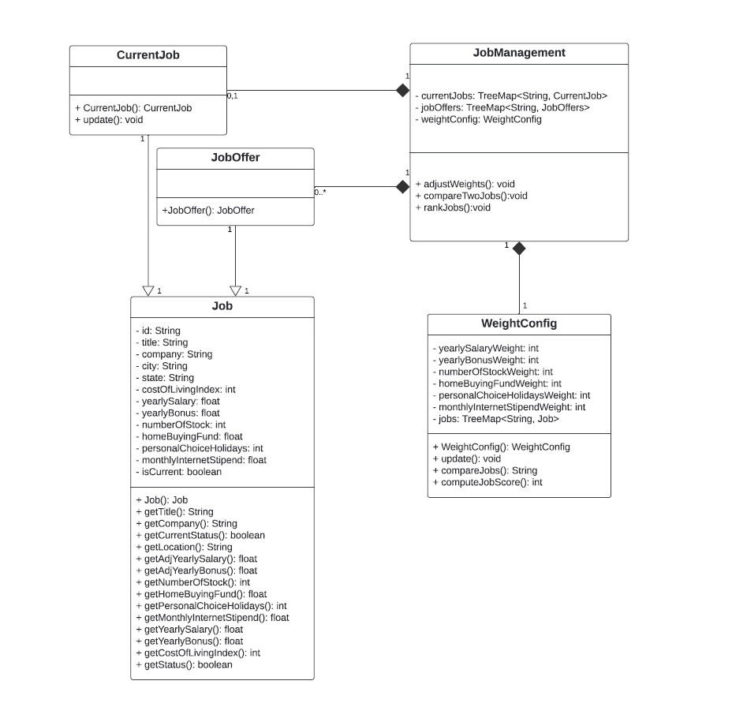
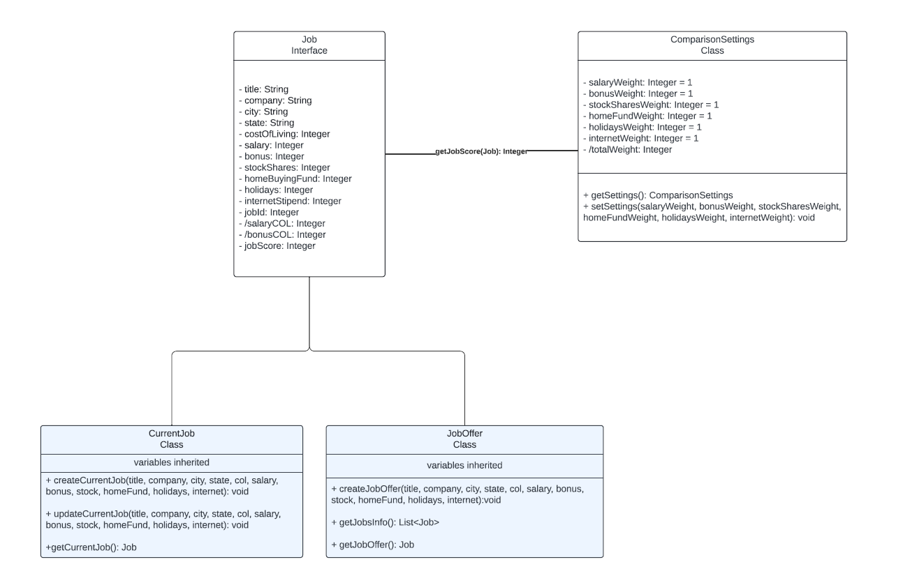
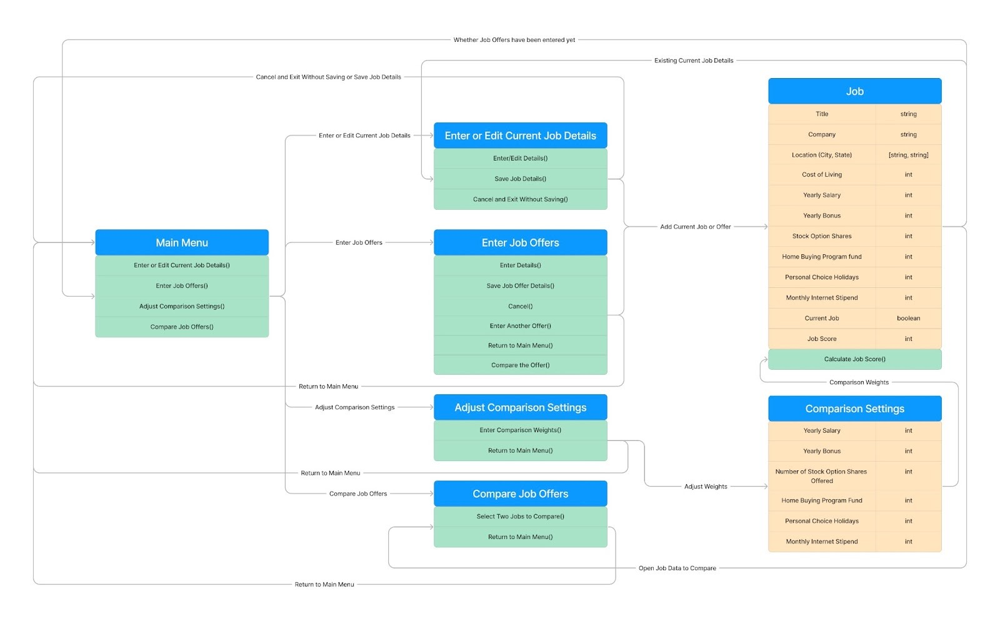
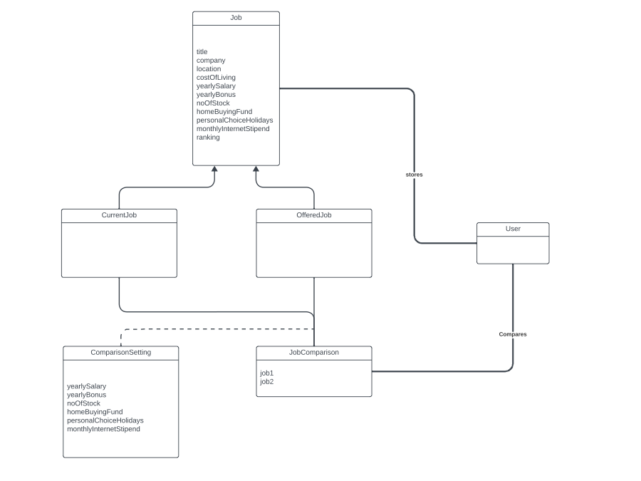
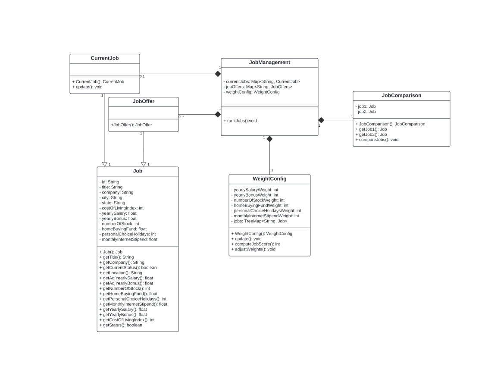

Design 1: hzhang961

Pros: Having job accessors in the job class, weight config setup is good, splitting up currentjob and joboffer, having create currentjob and update currentjob as two separate functions, weightconfig functions are well built out, JobManagement to tie pieces together

Cons: Space concerns if too many jobs are created, a lot of JobManagement can be done in the front end. There seems to be some redundancy in the attributes and methods across classes, such as Job and CurrentJob. This could lead to duplication of code and effort, and might complicate maintenance.

Design 2: ccollier40

Pros: Splitting up currentJob and jobOffer allows for extensibility. Good setup for tracking configs in the comparisonSetting class

Cons: Represent job management tasks, Add functionality for querying and displaying ranked job results, total weight could be implemented on the frontend

Design 3: jrosenthal9

Pros: The diagram outlines a clear workflow for the user interface. Good bundling of functions by categories

Cons: More UI focused, functions don’t include inputs and returns, splitting up job to current and offers to allow functionality down the line

Design 4: nrajbhandari3

Pros: Splitting up of current job and offered job. Job comparison to store the jobs being compared.

Cons: Lacks details in terms of methods and method signature. More explicitly define the function. Variables/fields not having data types.

Team Design:

Main Commonalities:
We worked off of design 1 as the starting point - we found that it was similar to all of the other designs but the closest to what we wanted to present. The main commonalities between our group design and the individual designs was in the way the classes were split up, all of the designs have a Job class that houses the majority of the attributes the Job needs to hold. All of the designs also have a WeightConfig class that holds the values for the weights to be applied for comparisons. We also found that we had the attributes for each class in common other than having a boolean to determine whether a Job was current or an offer.

Main Differences:
During our discussion we decided the pieces of each design that should be included and worked from there to create the team design. We started with a Job Parent class that the CurrentJob and JobOffer child classes inherent from to differentiate the current job from the job offers, and allow future functionality expansions to treat the two differently. We also ensured we had an entry point to the system for the user in the form of the JobManagement class, and added the JobComparison class to handle the comparison functions that are required of the program. Another focus was including the information about the data types of the attributes each class holds to simplify the software development process.

Justifications:
Instead of just a singular Job class we decided to have the Job class be a parent class that the CurrentJob and JobOffer classes inherit from. This allows us to reuse the attributes and getter functions of the Job class but still have unique functionality for treating an offer and the current job. The other main decision we made was having JobComparison be a separate class, this allows us to keep the associated functions grouped together since that will be building the UI table that shows the comparison between two jobs.

Summary:

All of the designs submitted by the team had a similar theme. However, there were some differences as well. Collectively, we learned that splitting current job and offered job as a sub-type of parent class Job provides us the flexibility in approaching the various requirements. Instead of tracking this information as an attribute in the Job class, a parent child relationship benefits us with ease of abstraction and encapsulation.

We also discussed the benefit of calling out the function arguments and return types in the diagram. Having this information encoded in the document helps us understand the behavior of the class much more efficiently. We also had a candid discussion about data structures and data types - the team paid attention to the fact that this application will run on a mobile phone instead of a desktop computer.

We quickly came to an agreement on the final team design. The fact that we had similar designs helped, but the team also approached the task with an open mind and collaborative spirit. We feel that regular touchpoints and communication through Discord will help us succeed in future Group assignments too.

