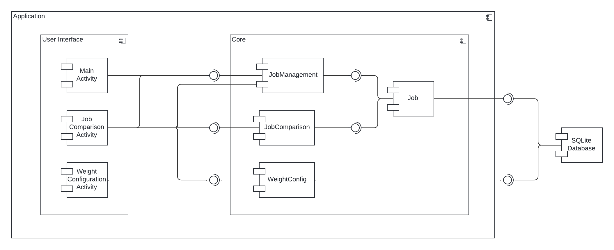
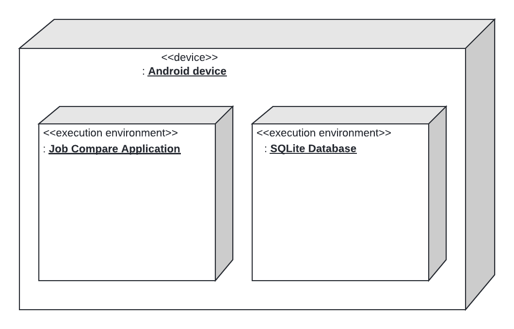

# Design Document

**Author**: Team 110

## 1 Design Considerations

### 1.1 Assumptions

- The application is specifically designed and developed for the Android operating system.
- The application should run for the latest versions of Android (13 and 14).
- No personally identifiable information (PII) will be stored within the application.
- The application will only be used by a single user at a time. All information stored will pertain to a single user, and data will not defer based on who is using the application at any given time.
- User authentication is not required.
- The application is dependent on availability and access to SQLite database.
- The application should have minimal memory footprint and processing requirement.
- All application components and dependencies are self-contained in the Android device.

### 1.2 Constraints

- The application is contrained by the physical hardware. The computing environment is dictated by the type of android device used to run the application.
- The view port of the devices are limited in size.
- There are no network constraints as the application does not need to communicate with a server.
- Since the application has no authentication and authorization mechanism, the data stored and displayed need to be harmless.

### 1.3 System Environment

*Describe the hardware and software that the system must operate in and interact with.*

- The application will run in Android 13 and 14.
- The application will run in any Android phone or tablet.
- The application is dependent on the available SQLite database for persistence.

## 2 Architectural Design

### 2.1 Component Diagram

### 2.2 Deployment Diagram

## 3 Low-Level Design

*Describe the low-level design for each of the system components identified in the previous section. For each component, you should provide details in the following UML diagrams to show its internal structure.*

### 3.1 Class Diagram

*In the case of an OO design, the internal structure of a software component would typically be expressed as a UML class diagram that represents the static class structure for the component and their relationships.*

### 3.2 Other Diagrams

*<u>Optionally</u>, you can decide to describe some dynamic aspects of your system using one or more behavioral diagrams, such as sequence and state diagrams.*

## 4 User Interface Design
*For GUI-based systems, this section should provide the specific format/layout of the user interface of the system (e.g., in the form of graphical mockups).*

