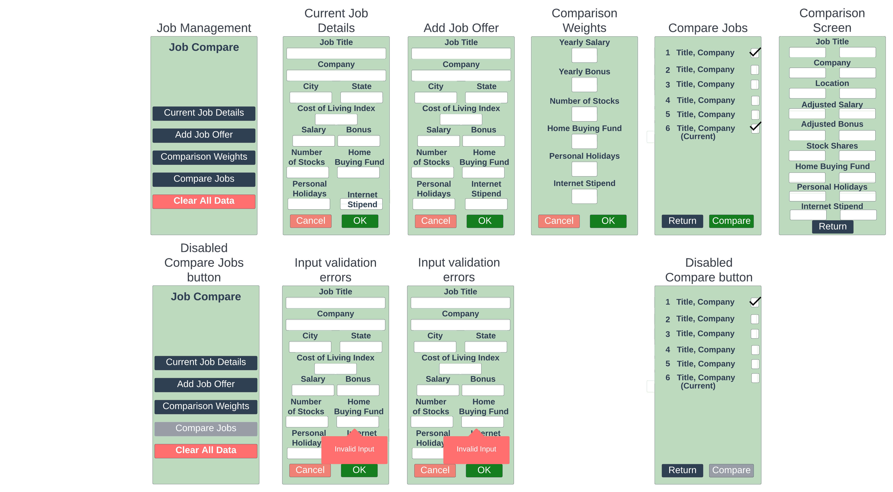

# Design Document

**Author**: Team 110

## 1 Design Considerations

### 1.1 Assumptions

- The application is specifically designed and developed for the Android operating system.
- The application should run for the latest versions of Android (13 and 14).
- No personally identifiable information (PII) will be stored within the application.
- The application will only be used by a single user at a time. All information stored will pertain to a single user, and data will not defer based on who is using the application at any given time.
- User authentication is not required.
- The application is dependent on availability and access to SQLite database.
- The application should have minimal memory footprint and processing requirement.
- All application components and dependencies are self-contained in the Android device.

### 1.2 Constraints

- The application is contrained by the physical hardware. The computing environment is dictated by the type of android device used to run the application.
- The view port of the devices are limited in size.
- There are no network constraints as the application does not need to communicate with a server.
- Since the application has no authentication and authorization mechanism, the data stored and displayed need to be harmless.

### 1.3 System Environment

*Describe the hardware and software that the system must operate in and interact with.*

- The application will run in Android 13 and 14.
- The application will run in any Android phone or tablet.
- The application is dependent on the available SQLite database for persistence.

## 2 Architectural Design

### 2.1 Component Diagram

### 2.2 Deployment Diagram

## 3 Low-Level Design

Job Management serves as the Main Menu class for the program. It contains the currentJobs and jobOffers maps. CurrentJobs and JobOffers are children of the Job class, this allows them to inherit the necessary methods and variables for the program to function. The Main Activity part of the UI will call the Job Management functions as necessary to create and update the jobs it is storing. Job Comparison activity will look at the Job Management class and the Job Comparison class to get the Jobs to compare and the necessary functions to run the comparison. And Weight configuration activity will update the weight config values and have the functions available to compute job scores. All of this will be stored in a SQLite Database that is held outside of the Application since we won't be modifying SQLite. 

### 3.1 Class Diagram

### 3.2 Other Diagrams

## 4 User Interface Design

