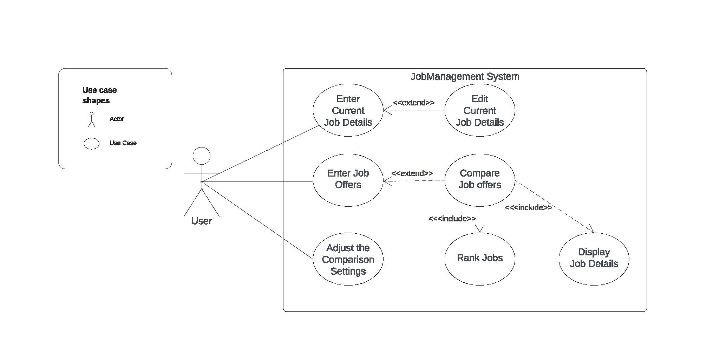

# Use Case Model

**Author**: hzhang961

## 1 Use Case Diagram

## 2 Use Case Descriptions
### Use Case 1: Enter Current Job
#### Requirements:
Allow the user to input and store information about their current job, including job title, company, and etc.
#### Pre-conditions:
The app is started. The user is presented with the main menu.
#### Post-conditions:
Be able to either save the job details or cancel and exit without saving, returning in both cases to the main menu.
#### Scenarios:
Normal Scenario:
User selects "Enter Current Job" from the main memu.
User enters details such as job title, company, and etc.
User confirms and saves the information.
User returns to the main menu.
Alternate Scenario (Cancel):
User selects "Enter Current Job" from the main memu.
User enters details such as job title, company, and etc.
User cancels the operation.
User returns to the main menu.

### Use Case 2: Edit Current Job
#### Requirements:
Allow the user to modify and update information about their current job.
#### Pre-conditions:
The app is started. The user is presented with the main menu. The user has entered information about their current job.
#### Post-conditions:
The updated information about the current job is successfully stored in the system.
#### Scenarios:
Normal Scenario:
User selects "Edit Current Job" from the main memu.
User edits details such as job title, company, and etc.
User confirms and saves the information.
User returns to the main menu.
Alternate Scenario (Cancel):
User selects "Edit Current Job" from the main memu.
User edits details such as job title, company, and etc.
User cancels the operation.
User returns to the main menu.

### Use Case 3: Enter job Offer
#### Requirements:
Allow the user to input and store information about their job offer, including job title, company, and etc.
#### Pre-conditions:
The app is started. The user is presented with the main menu.
#### Post-conditions:
Be able to either save the job offer details or cancel and exit without saving, returning in both cases to the main menu.
#### Scenarios:
Normal Scenario:
User selects "Enter Job Offer" from the main memu.
User enters details such as job title, company, and etc.
User confirms and saves the information.
User enter another offers, or returns to the main menu, or compare the job offer with the current job.
Alternate Scenario (Cancel):
User selects "Enter Job Offer" from the main memu.
User enters details such as job title, company, and etc.
User cancels the operation.
User enter another offers, or returns to the main menu, or compare the job offer with the current job.

### Use Case 4: Compare Weight Settings
#### Requirements:
Allow the user to configure the weights assigned to different attributes of the jobs.
#### Pre-conditions:
The app is started. The user is presented with the main menu.
#### Post-conditions:
The user's customized weight settings are saved in the system.
#### Scenarios:
Normal Scenario:
User selects "Adjust the Comparison Settings" from the main menu.
User adjusts the weights assigned to job attributes.
User confirms and saves the customized weight settings.
Alternate Scenario (Cancel):
User selects "Adjust the Comparison Settings" from the main menu.
User decides to cancel the operation.
The system retains the previous weight settings.

### Use Case 5: Compare Jobs
#### Requirements:
Allow the user to compare two jobs based on weights(if exists) and attributes.
#### Pre-conditions:
The user has stored at least two jobs in the system.
#### Post-conditions:
The user has the comparison results.
#### Scenarios:
Normal Scenario:
User selects "Compare Jobs" from the main menu.
User is shown a list of job offers, displayed as Title and Company, ranked from best to worst.
User chooses two jobs for comparison.
The system displays a side-by-side comparison of the selected jobs.
Exceptional Scenario (Insufficient Jobs):
User selects "Compare Jobs" from the main menu.
There are fewer than two jobs in the system.
The system informs the user that there are not enough jobs to compare.

### Use Case 6: Rank Jobs
#### Requirements:
Allow the system to displayed as Title and Company, ranked from best to worst based on weights and job attributes.
#### Pre-conditions:
The user has stored at least two jobs in the system.
#### Post-conditions:
The rankings are displayed to the user.
#### Scenarios:
Normal Scenario:
User selects "Compare Jobs" from the main menu.
The system calculates and displays the job ranked from best to worst.
Exceptional Scenario (Insufficient Jobs):
User selects "Compare Jobs" from the main menu.
There are fewer than two jobs in the system.
The system informs the user that there are not enough jobs to compare.

### Use Case 7: Display Job Details
#### Requirements:
Allow the user to view detailed information about a specific job during job comparison.
#### Pre-conditions:
The user has stored at least two jobs in the system. The user compares two jobs.
#### Post-conditions:
The user is presented with the detailed information about the two jobs that are compared.
#### Scenarios:
Normal Scenario:
User selects "Compare Jobs" from the main menu.
User is shown a list of job offers, displayed as Title and Company, ranked from best to worst.
User chooses two jobs for comparison.
The system displays a side-by-side comparison of the selected jobs, including job details.